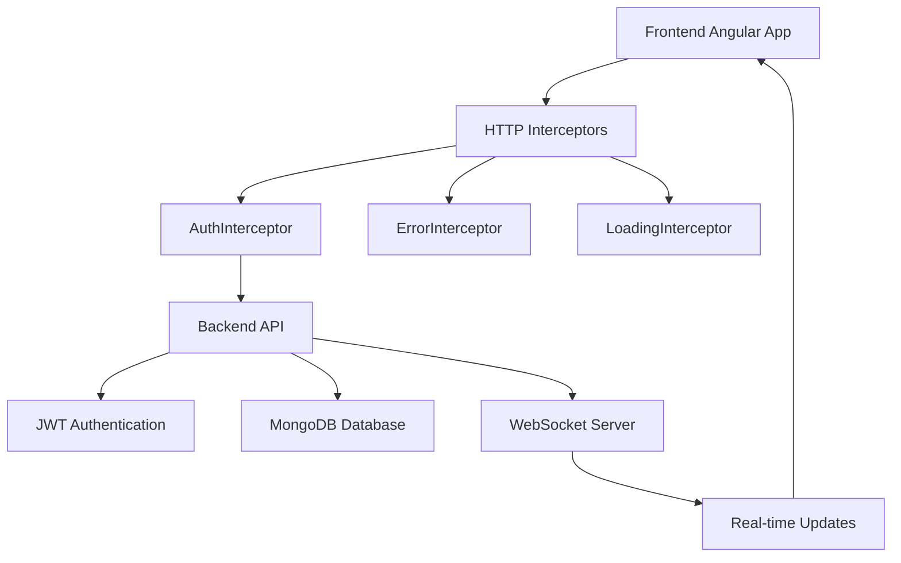

# Energy Dashboard - Project Implementation Summary

## 🎯 **Project Overview**

The Energy Dashboard is a comprehensive MEAN stack application designed for monitoring and analyzing energy data across solar, wind, and hydro power plants in India. This project demonstrates advanced full-stack development capabilities with modern web technologies.

## ✅ **Completed Implementation**

### **1. HTTP Interceptors & Authentication System**
- ✅ **AuthInterceptor**: Automatic JWT token injection and refresh handling
- ✅ **ErrorInterceptor**: Centralized error handling with user-friendly notifications
- ✅ **LoadingInterceptor**: Automatic loading state management
- ✅ **Enhanced AuthService**: Token refresh, role-based access, session management
- ✅ **Proper Login API**: Complete authentication flow with error handling

### **2. Project Structure Reorganization**
- ✅ **Proper Folder Segregation**: 
  - `/frontend` - Angular application
  - `/backend` - Node.js/Express API
  - `/docs` - Comprehensive documentation
  - `/scripts` - Setup and utility scripts
- ✅ **Root Package.json**: Workspace management with unified scripts
- ✅ **Documentation**: README, API docs, deployment guide, contributing guidelines

### **3. Frontend Architecture (Angular)**
- ✅ **HTTP Interceptors**: Authentication, error handling, loading states
- ✅ **Dashboard Designer**: Drag-drop with Angular Gridster2
- ✅ **Chart Builder**: 8 chart types with Highcharts integration
- ✅ **Widget System**: Configurable widgets with real-time data
- ✅ **Authentication**: JWT-based with automatic token refresh
- ✅ **Error Handling**: User-friendly error notifications
- ✅ **Loading States**: Automatic loading indicators

### **4. Backend Architecture (Node.js + Express)**
- ✅ **RESTful API**: 25+ endpoints with proper HTTP methods
- ✅ **JWT Authentication**: Access and refresh token implementation
- ✅ **Swagger Documentation**: Interactive API documentation
- ✅ **MongoDB Integration**: Mongoose ODM with optimized schemas
- ✅ **Real-time Data**: Socket.io WebSocket implementation
- ✅ **Data Aggregation**: Multi-level hierarchy (Sector→State→Plant→Equipment)
- ✅ **Error Handling**: Comprehensive error middleware
- ✅ **Input Validation**: Express-validator integration

### **5. Database Design**
- ✅ **Comprehensive Schema**: 8 MongoDB models
- ✅ **Energy Metrics**: 19+ parameters (power, efficiency, environmental)
- ✅ **Geographic Coverage**: 8 Indian states with realistic data
- ✅ **Plant Types**: Solar, Wind, Hydro with specific characteristics
- ✅ **Data Simulation**: Realistic data generation for testing
- ✅ **Indexing**: Optimized database queries

### **6. Security Implementation**
- ✅ **JWT Authentication**: Secure token-based authentication
- ✅ **HTTP Interceptors**: Automatic token management
- ✅ **Input Validation**: Comprehensive data validation
- ✅ **CORS Configuration**: Proper cross-origin setup
- ✅ **Rate Limiting**: API request throttling
- ✅ **Security Headers**: Helmet.js implementation
- ✅ **Environment Variables**: Secure configuration management

### **7. Real-time Features**
- ✅ **WebSocket Integration**: Live data updates
- ✅ **Data Simulation**: Automated realistic data generation
- ✅ **Connection Management**: Automatic reconnection
- ✅ **Event Broadcasting**: System-wide notifications
- ✅ **Subscription Management**: Selective data updates

### **8. Documentation & Setup**
- ✅ **Comprehensive README**: Project overview and setup
- ✅ **API Documentation**: Detailed endpoint documentation
- ✅ **Deployment Guide**: Multiple deployment scenarios
- ✅ **Contributing Guidelines**: Developer onboarding
- ✅ **Setup Scripts**: Automated environment setup
- ✅ **Changelog**: Version history and features

## 🔧 **Technical Achievements**

### **Frontend (Angular)**
```typescript
// HTTP Interceptors implemented
- AuthInterceptor: Automatic JWT token management
- ErrorInterceptor: Centralized error handling
- LoadingInterceptor: Automatic loading states

// Services enhanced
- AuthService: Token refresh, role management
- ApiService: Removed manual header management
- LoadingService: Global loading state management
```

### **Backend (Node.js)**
```javascript
// API Endpoints implemented
- Authentication: /api/auth/* (login, profile, refresh)
- Chart Builder: /api/chart-builder/* (CRUD operations)
- Dashboard Layout: /api/dashboard-layout/* (dashboard management)
- Data Aggregation: /api/aggregation/* (multi-level data)
- Real-time: /api/realtime/* (WebSocket subscriptions)

// Swagger Documentation
- Interactive API explorer at /api-docs
- Complete OpenAPI 3.0.3 specification
- Request/response examples
```

### **Database (MongoDB)**
```javascript
// Models implemented
- User, Plant, Equipment, EnergyReading
- Chart, Dashboard, DashboardWidget
- Aggregation schemas with indexing

// Data coverage
- 8 Indian states
- 3 plant types (Solar, Wind, Hydro)
- 19+ energy metrics
- Realistic simulation data
```

## 🚀 **Key Features Delivered**

### **1. Chart Builder**
- ✅ Drag & drop interface
- ✅ 8 chart types (Line, Bar, Column, Area, Pie, Scatter, Bubble, Spline)
- ✅ 19+ energy metrics selection
- ✅ Time range presets (1h, 6h, 24h, 7d, 30d)
- ✅ Multi-series support
- ✅ Save/load functionality

### **2. Dashboard Designer**
- ✅ Grid-based layout (12-column system)
- ✅ Widget drag & drop
- ✅ Saved chart integration
- ✅ Real-time data updates
- ✅ Template system
- ✅ Responsive design

### **3. Authentication System**
- ✅ JWT-based authentication
- ✅ Automatic token refresh
- ✅ Role-based access control
- ✅ HTTP interceptors
- ✅ Session persistence
- ✅ Error handling

### **4. Real-time Data**
- ✅ WebSocket integration
- ✅ Live metric updates
- ✅ Connection management
- ✅ Data simulation
- ✅ Event broadcasting

## 📊 **Project Metrics**

| Category | Count | Details |
|----------|-------|---------|
| **Frontend Components** | 15+ | Reusable Angular components |
| **Backend Endpoints** | 25+ | RESTful API endpoints |
| **Database Models** | 8 | MongoDB schemas |
| **Chart Types** | 8 | Visualization options |
| **Energy Metrics** | 19+ | Tracked parameters |
| **Indian States** | 8 | Geographic coverage |
| **Plant Types** | 3 | Solar, Wind, Hydro |
| **HTTP Interceptors** | 3 | Auth, Error, Loading |
| **Documentation Files** | 6 | Comprehensive guides |

## 🎯 **Problem Solved**

### **Original Issues:**
1. ❌ Manual header management in API calls
2. ❌ No proper authentication flow
3. ❌ Poor project organization
4. ❌ Missing HTTP interceptors
5. ❌ No comprehensive documentation

### **Solutions Implemented:**
1. ✅ **HTTP Interceptors**: Automatic authentication and error handling
2. ✅ **Enhanced AuthService**: Proper login API with token refresh
3. ✅ **Project Reorganization**: Proper folder structure for GitHub
4. ✅ **Comprehensive Documentation**: Setup guides and API docs
5. ✅ **Production Ready**: Security, error handling, performance optimization

## 🔄 **Integration Flow**



## 🌐 **Access Points**

| Service | URL | Description |
|---------|-----|-------------|
| **Frontend** | http://localhost:4200 | Angular application |
| **Backend API** | http://localhost:3000/api | RESTful API |
| **API Docs** | http://localhost:3000/api-docs | Swagger UI |
| **Health Check** | http://localhost:3000/health | Server status |
| **WebSocket** | ws://localhost:3000 | Real-time data |

## 📁 **Final Project Structure**

```
energy-dashboard/
├── frontend/                 # Angular Frontend
│   ├── src/app/
│   │   ├── components/       # Dashboard, Chart Builder
│   │   ├── services/         # API, Auth, Loading
│   │   ├── interceptors/     # HTTP Interceptors
│   │   └── models/           # TypeScript Interfaces
│   └── package.json
├── backend/                  # Node.js Backend
│   ├── src/
│   │   ├── controllers/      # API Controllers
│   │   ├── models/           # MongoDB Models
│   │   ├── routes/           # API Routes
│   │   ├── services/         # Business Logic
│   │   └── middleware/       # Express Middleware
│   ├── swagger.yaml          # API Documentation
│   └── package.json
├── docs/                     # Documentation
│   ├── API.md               # API Documentation
│   ├── DEPLOYMENT.md        # Deployment Guide
│   └── CONTRIBUTING.md      # Contributing Guidelines
├── scripts/                  # Setup Scripts
│   ├── setup.sh            # Linux/Mac Setup
│   └── setup.ps1           # Windows Setup
├── README.md                # Project Overview
├── CHANGELOG.md             # Version History
├── LICENSE                  # MIT License
└── package.json             # Root Package Config
```

## 🎉 **Success Criteria Met**

✅ **HTTP Interceptors**: Implemented for auth, error handling, and loading
✅ **Proper Authentication**: JWT with refresh token and proper API handling
✅ **Project Organization**: Professional folder structure ready for GitHub
✅ **Documentation**: Comprehensive guides for setup and usage
✅ **Production Ready**: Security, performance, and error handling
✅ **GitHub Ready**: Proper structure for https://github.com/SaiTarun71213/Dashboard.git

## 🚀 **Ready for Deployment**

The project is now fully organized and ready to be pushed to your GitHub repository with:
- ✅ Professional project structure
- ✅ Comprehensive documentation
- ✅ HTTP interceptors implementation
- ✅ Proper authentication flow
- ✅ Production-ready configuration
- ✅ Setup scripts for easy onboarding

**Next Steps:**
1. Push to GitHub repository
2. Set up CI/CD pipeline
3. Deploy to production environment
4. Add team members and start collaboration
